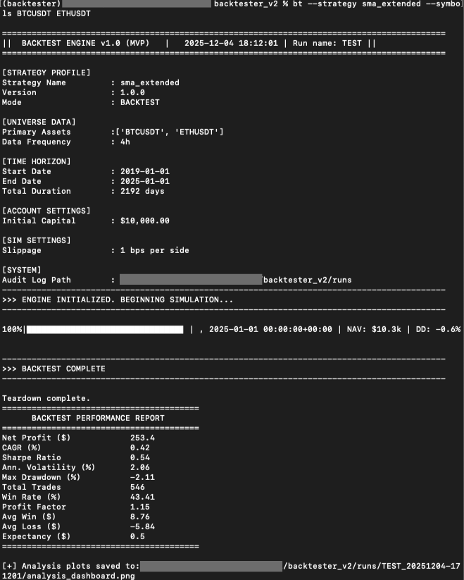

# Backtester V2: Event-Driven Quantitative Trading Engine

[](https://github.com/ibachni/backtester_v2/actions/workflows/ci.yml)
[](https://www.python.org/downloads/)
[](LICENSE)
[](https://github.com/astral-sh/ruff)
[](https://mypy-lang.org/)

## 1. Overview
Backtester V2 is a a high-fidelity, **event-driven** trading engine built for **crypto derivatives** (Spot, Futures, Options), however, the architecture is built to be asset-agnostic. Core features include a **deterministic** "tick-and-drain" event loop that guarantees reproducibility across runs. The backtester combines grandular tick-lvel simulation with high-throughput using Polars and Parquet (Throughput: ~68,000 events/second on M4 Pro, see full analysis under 6. Performance & Benchmarks.)

## 2. Core Architecture: The "Tick-and-Drain" Loop
Unlike vectorized backtesters that prioritize speed over fidelity, Backtester V2 uses a strict **Tick-and-Drain** event loop ([ADR 021](adr/021-micro-batch.md)).
1. **Micro-Batching:** Time advances only when the event queue for time $T$ is fully drained.
2. **Causality:** Guarantees that a signal generated at $T$ cannot be acted upon until $T+\Delta$.
3. **Determinism:** A run with the same config, data, and seed produces the exact same ledger, regardless of thread scheduling.

(This approach lacks realism to simulate high-frequency trading. However, this type of trading is out of scope of this software project.)

## 3. Engineering Standards & ADRs
Major architectural decisions are documented to track trade-offs and context:
- [ADR 001: Determinism by Default](adr/001-determinism-by-default.md)
- [ADR 018: Risk Rails & Pre-Trade Checks](adr/018-risk-rails-pretrade-and-halt.md)
- [ADR 021: Micro-Batch Architecture](adr/021-micro-batch.md)

### Code Quality & Rigor
- **Type Safety:** Fully typed codebase using Python type hints and `mypy` for static analysis.
- **Code Quality:** Enforced via `ruff` (linting/formatting) and `pre-commit` hooks.

## 4. Key Features
### Market Microstructure Simulation
- **Execution Models:** Supports **Slippage** and Market Impact models (current: Fixed BPS) defined in ([`SlippageModel`](backtester/sim/sim_models.py)).
- **Fee Structures:** Native support for Maker/Taker tiers and fixed BPS fee models ([`FeeModel`](backtester/sim/sim_models.py)).

### Pre-Trade Risk Engine
- **Risk Rails:** Enforces exchange constraints like Max Notional, Lot Size, and Tick Size via [`SymbolSpecs`](backtester/risk/order_validation.py).
- **Safety:** Fail-closed design with global halt capabilities.

### Data Pipeline
Built on **Polars** and **Parquet** for high-throughput ingestion of tick-level data.
- **Multi-Asset Support:** Native handling of Spot, Futures, and Options.
- **Sanitization:** Automated checks for negative prices, broken OHLC invariants, and gaps.
- **Storage:** Partitioned Parquet datasets (`year=YYYY/symbol.parquet`) for efficient querying.

## 5. System Architecture
The engine follows a **Modular Monolith** architecture where distinct domains (Strategy, Risk, Execution, Account) are decoupled and communicate exclusively via an in-memory **Event Bus**.

### Event Bus Topology
Components publish and subscribe to typed topics, ensuring strict separation of concerns.
- **Strategy:** Subscribes to `T_CANDLES`, publishes `T_ORDERS_INTENT`.
- **Risk:** Intercepts intents, validates them, and publishes `T_ORDERS_SANITIZED`.
- **Execution:** Matches sanitized orders against market data and publishes `T_FILLS`.
- **Account:** Tracks state and publishes `T_ACCOUNT_SNAPSHOT`.

```
mermaid
---
config:
  theme: base
  look: neo
  layout: elk
---
flowchart TB
 subgraph Orchestration["Orchestration & Time (The Tick-and-Drain Loop)"]
    direction TB
        Engine["Backtest Engine"]
        Clock(("SimClock"))
        Barrier{"Wait Until Idle"}
        Feed["BarFeed"]
  end
 subgraph DataIngest["Data Ingestion"]
        Parquet[("Parquet Lake")]
  end
 subgraph StratDomain["Strategy Domain"]
        Strategy["Strategy Runner"]
  end
 subgraph RiskDomain["Risk"]
        Validation["Order Validation"]
  end
 subgraph ExecDomain["Execution & Matching"]
        Sim["Execution Sim"]
  end
 subgraph AcctDomain["Accounting"]
        Account["Account Engine"]
  end
 subgraph EventBus["In-Memory Event Bus (Pub/Sub)"]
    direction TB
        StratDomain
        RiskDomain
        ExecDomain
        AcctDomain
  end
 subgraph Output["Persistence & Analytics"]
        Audit["Audit Writer"]
        Perf["Performance Engine"]
        JSONL[("account.csv")]
  end
    Engine -- "1. Advance Time" --> Clock
    Engine == "2. Push Data" ==> Feed
    Engine -- "3. Await Drain" --> Barrier
    Parquet --> Feed
    Audit --> JSONL
    Feed == T_CANDLES ==> Strategy
    Feed -- T_CANDLES --> Sim & Account
    Strategy == T_ORDERS_INTENT ==> Validation
    Validation == T_ORDERS_SANITIZED ==> Sim
    Validation -- T_ORDERS_REJECTED --> Strategy
    Sim -- T_FILLS --> Strategy
    Sim == T_FILLS ==> Account
    Sim -- T_ORDERS_ACK --> Strategy
    Account == T_ACCOUNT_SNAPSHOT ==> Perf
    Account -- T_ACCOUNT_SNAPSHOT --> Audit
    Account == T_TRADE_EVENT ==> Perf
    Barrier -. Monitors Queue Depth .-> Strategy & Sim & Account
Sim -.- n9
    n9["The AuditWriter listens to the bus and logs relevant messages."]:::note

     Engine:::control
     Clock:::control
     Barrier:::control
     Feed:::domain
     Parquet:::storage
     Strategy:::domain
     Validation:::domain
     Sim:::domain
     Account:::domain
     Audit:::storage
     Perf:::domain
     JSONL:::storage
    classDef domain fill:#f9f9f9,stroke:#333,stroke-width:2px,color:#000
    classDef bus fill:#e1f5fe,stroke:#01579b,stroke-width:1px,color:#000,stroke-dasharray: 5 5
    classDef storage fill:#fff3e0,stroke:#e65100,stroke-width:2px,color:#000
    classDef control fill:#fce4ec,stroke:#880e4f,stroke-width:2px,color:#000
    linkStyle 1 stroke:#D50000,fill:none
    linkStyle 5 stroke:#D50000,fill:none
    linkStyle 8 stroke:#D50000,fill:none
    linkStyle 9 stroke:#D50000,fill:none
    linkStyle 12 stroke:#D50000,fill:none
    linkStyle 14 stroke:#D50000,fill:none
    linkStyle 16 stroke:#D50000,fill:none
```

For a complete registry of topics and payloads, see [**Bus Topology & Module I/O**](docs/bus_topology.md).

## 6. Performance & Benchmarks
While event-driven engines are inherently slower than vectorized simulations, Backtester V2 is optimized for high-throughput research iterations.

The following benchmarks measure the "Stress Test" configuration: a high-frequency churn strategy ($T=1m$) processing tick-level state updates with full risk validation enabled.

| Metric | Result | Notes |
| :--- | :--- | :--- |
| **Throughput** | **67,976 events/sec** | Includes signal generation, risk checks, and filling |
| **Order Latency** | **~1,084 orders/sec** | Full lifecycle (Intent $\to$ Risk $\to$ Match $\to$ Fill) |
| **Total Runtime** | **12 min 18 sec** | Processed 6 years (2192 days) of M1 Data |
| **Events Processed** | **50,189,938** | Total distinct bus messages handled |
| **Drift** | **0ms** | Strict event ordering guarantees zero look-ahead |

*Hardware: MacBook M4 Pro, running on Python 3.12.*


## 7. Getting Started
### Prerequisites
- **Python 3.11+**
- **pip**

### Installation
1. Clone the repository:
   ```bash
   git clone https://github.com/nicolas/backtester_v2.git
   cd backtester_v2
   ```

2. Create a virtual environment and install dependencies:
   ```bash
   python -m venv .venv
   source .venv/bin/activate  # On Windows: .venv\Scripts\activate
   pip install -e ".[dev]"
   ```

3. Verify installation:
   ```bash
   bt --help
   ```

### Running a Backtest
To execute a backtest, you need a **Backtest Configuration** (engine settings `backtest.toml`) and a **Strategy Configuration** (algo parameters, e.g., `sma_extended.toml`), located in the `configs/` folder.

```bash
# Example usage
bt --strategy sma_extended --symbols BTCUSDT ETHUSDT
```

**Console Output**: The engine provides a high-visibility CLI dashboard summarizing the simulation parameters and final performance report (Tear Sheet).



Figure 1: Terminal output demonstrating a sanity check run using a basic SMA strategy on 4h data.

Results (logs, metrics, audit trails) are automatically serialized to the runs/ directory for further analysis.

## 8. Data Ingestion
Before running a backtest, you need to download historical data. Currently, this is done via a Python script using the `DownloaderFiles`, `ParsingSanitizing`, and `WritingParquet` components, see [Downloading](docs/downloading_data.md) for an example.


## 9. Strategy Implementation
Strategies implement the [`Strategy`](backtester/strategy/base.py) abstract base class. The core logic resides in two main event hooks:

- **`on_candle(self, candle: Candle) -> list[OrderIntent]`**: Called for every new candle. This is where you update indicators, check signals, and return a list of `OrderIntent` (e.g., `MarketOrderIntent`, `LimitOrderIntent`) to be executed.
- **`on_fill(self, fill: Fill) -> list[OrderIntent]`**: Called whenever an order is filled. Use this to manage position state or issue follow-up orders (e.g., stop-loss/take-profit).

The engine handles all state management, order routing, and time-travel safety. Strategies are designed to be **side-effect free** regarding the external world — they only emit intents.

For a complete reference implementation, see [`SMAExtendedStrategy`](backtester/strategy/sma_extended.py), which demonstrates:
- Parameter management
- Rolling window calculations (SMA)
- State tracking (positions, cooldowns)
- Risk controls (daily loss limits)


## 10. Project Roadmap

### Data & Analytics
- [ ] **Parameter Optimization:** Grid search and genetic algorithm runners for strategy tuning.
- [ ] **Historical Data Splitter** Helpers to split historical data into optimization & walk forward

### Live Trading & Infrastructure
- [ ] **Live Execution Adapter:** "Paper Trading" and "Live Trading" modes connecting to real exchange APIs.
- [ ] **Distributed Backtesting:** Parallel execution of backtests for large-scale parameter sweeps.
- [ ] **Web Dashboard:** A lightweight UI for monitoring active backtests and visualizing results.

## Note:
- **Testing** The goal is to stabilize the core API. The existing Unit and property-based tests (via Hypothesis) are being migrated from v1 to ensure invariant preservation across the new event loop.
