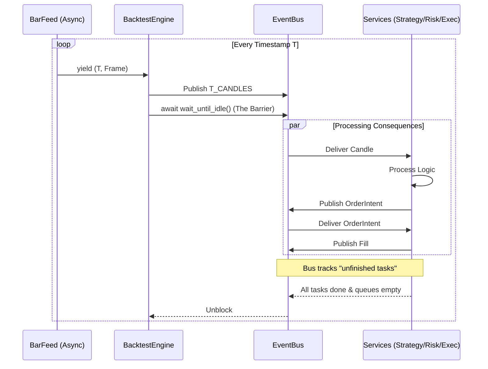

# Orchestration & Event Loop Architecture

**Status:** Active
**Based on:** [ADR 021](../adr/021-micro-batch.md), [ADR 023](../adr/023-async-data-feeder.md)
**Implementation:** [`BacktestEngine`](../backtester/core/backtest_engine_new.py)

This document defines the orchestration logic for `Backtester_v2`. The system uses a **Micro-Batch (Tick-and-Drain)** architecture to guarantee determinism, causality, and crash safety in an asynchronous environment.

---

## 1. Core Philosophy: Tick-and-Drain

Unlike "free-running" event loops where producers and consumers operate independently, the Backtester V2 Engine acts as a strict synchronizer.

**The Golden Rule:** Time $T$ must be fully resolved—meaning all resulting signals, orders, fills, and accounting updates are finished—before Time $T+1$ begins.

### The Loop Cycle
1.  **Tick:** The Engine advances the clock to $T$ and injects market data.
2.  **Drain (The Barrier):** The Engine blocks and waits until the Event Bus is completely idle.
3.  **Advance:** Only when the queue is empty and all subscribers have released their processing locks does the Engine proceed to $T+1$.

---

## 2. The Orchestration Loop

The heartbeat of the system is the `feed_candles` method in `BacktestEngine`. It drives the simulation via an Async Generator pipeline (ADR 023).



### The Barrier Mechanism (`wait_until_idle`)
The Engine relies on the Bus to track the "active work" count.
1.  When a message is published, `unfinished_tasks` increments.
2.  Subscribers consume messages using the **Consume Pattern** (see below).
3.  When a subscriber finishes a `consume()` block, `unfinished_tasks` decrements.
4.  The Engine remains blocked at `await self._bus.wait_until_idle()` until `unfinished_tasks == 0` and the queue depth is 0.

---

## 3. The "Consume" Pattern

To support the Barrier, subscribers must strictly use the `consume()` context manager. This holds a "processing lock" on the Bus, preventing the Engine from advancing time while a component is working.

**Correct Usage:**
```python
async with sub.consume() as env:
    if env.topic == T_CANDLES:
        # 1. Calculate logic
        # 2. Publish downstream events (Orders)
        await bus.publish(...)
# Lock is released here.
# If we published an Order, the Bus count remains > 0, keeping the Engine blocked.
```

**Prohibited:**
- `async for msg in sub`: Acknowledges the message too early.
- `sub.queue.get()`: Requires manual `task_done()` management (error-prone).
- **Deadlock Risk:** Never `await` a *future* event inside a `consume` block.

---

## 4. Service Architecture

The Engine orchestrates domain logic via `BacktestService` implementations.

### `BacktestService`
An abstract base class that encapsulates:
- **Connection:** Subscribing to specific topics.
- **Run Loop:** An infinite loop consuming events until `EOF`.
- **Metrics:** Reporting final state on shutdown.

**Standard Services:**
1.  **StrategyRunner:** Consumes `CANDLES`/`FILLS`, emits `ORDER_INTENT`.
2.  **RiskEngine:** Consumes `ORDER_INTENT`, emits `SANITIZED_ORDER` or `REJECT`.
3.  **ExecutionSimulator:** Consumes `SANITIZED_ORDER`, emits `FILL`/`ACK`.
4.  **AuditRunner:** Consumes all topics, writes to disk.

---

## 5. Lifecycle Management

The `run_async` method manages the full lifecycle of a backtest run.

1.  **Setup Phase:**
    - Initialize `AuditWriter`.
    - Register Bus topics (with schema validation).
    - Initialize Strategy (call `on_start`).
    - Create `BarFeed` and data subscriptions.

2.  **Wiring Phase:**
    - Create an `asyncio.TaskGroup`.
    - Spawn `service.run()` tasks for every registered service.
    - Emit `ENGINE_READY` log.

3.  **Execution Phase:**
    - Start the `BarFeed` (Producer).
    - Spawn the `feed_candles` task (The Driver).
    - Spawn the `eof_manager` task (Waits for feed completion).

4.  **Teardown Phase:**
    - **Success:** Feed yields all data -> `feed_candles` returns metrics.
    - **EOF:** Engine publishes `ControlEvent(type='eof')`.
    - **Shutdown:** Services see `EOF` and break their loops.
    - **Cleanup:** Bus closes, Audit flushes to disk.

---

## 6. Data Pipeline (Async)

Per [ADR 023](../adr/023-async-data-feeder.md), the data pipeline is fully asynchronous to prevent blocking the event loop during I/O.

1.  **Source:** `ParquetCandleSource` (Async Iterator) yields batches from disk, yielding control to `asyncio` loop between reads.
2.  **Resampler:** Aggregates lower-timeframe data if needed.
3.  **BarFeed:** Aligns multiple sources by timestamp (heap sort) and yields a unified `Frame` to the Engine.

This ensures# filepath: docs/orchestration.md
# Orchestration & Event Loop Architecture

**Status:** Active
**Based on:** [ADR 021](../adr/021-micro-batch.md), [ADR 023](../adr/023-async-data-feeder.md)
**Implementation:** [`BacktestEngine`](../backtester/core/backtest_engine_new.py)

This document defines the orchestration logic for `Backtester_v2`. The system uses a **Micro-Batch (Tick-and-Drain)** architecture to guarantee determinism, causality, and crash safety in an asynchronous environment.

---

## 1. Core Philosophy: Tick-and-Drain

Unlike "free-running" event loops where producers and consumers operate independently, the Backtester V2 Engine acts as a strict synchronizer.

**The Golden Rule:** Time $T$ must be fully resolved—meaning all resulting signals, orders, fills, and accounting updates are finished—before Time $T+1$ begins.

### The Loop Cycle
1.  **Tick:** The Engine advances the clock to $T$ and injects market data.
2.  **Drain (The Barrier):** The Engine blocks and waits until the Event Bus is completely idle.
3.  **Advance:** Only when the queue is empty and all subscribers have released their processing locks does the Engine proceed to $T+1$.

---

## 2. The Orchestration Loop

The heartbeat of the system is the `feed_candles` method in `BacktestEngine`. It drives the simulation via an Async Generator pipeline (ADR 023).


### The Barrier Mechanism (`wait_until_idle`)
The Engine relies on the Bus to track the "active work" count.
1.  When a message is published, `unfinished_tasks` increments.
2.  Subscribers consume messages using the **Consume Pattern** (see below).
3.  When a subscriber finishes a `consume()` block, `unfinished_tasks` decrements.
4.  The Engine remains blocked at `await self._bus.wait_until_idle()` until `unfinished_tasks == 0` and the queue depth is 0.

---

## 3. The "Consume" Pattern

To support the Barrier, subscribers must strictly use the `consume()` context manager. This holds a "processing lock" on the Bus, preventing the Engine from advancing time while a component is working.

**Correct Usage:**
```python
async with sub.consume() as env:
    if env.topic == T_CANDLES:
        # 1. Calculate logic
        # 2. Publish downstream events (Orders)
        await bus.publish(...)
# Lock is released here.
# If we published an Order, the Bus count remains > 0, keeping the Engine blocked.
```

**Prohibited:**
- `async for msg in sub`: Acknowledges the message too early.
- `sub.queue.get()`: Requires manual `task_done()` management (error-prone).
- **Deadlock Risk:** Never `await` a *future* event inside a `consume` block.

---

## 4. Service Architecture

The Engine orchestrates domain logic via `BacktestService` implementations.

### `BacktestService`
An abstract base class that encapsulates:
- **Connection:** Subscribing to specific topics.
- **Run Loop:** An infinite loop consuming events until `EOF`.
- **Metrics:** Reporting final state on shutdown.

**Standard Services:**
1.  **StrategyRunner:** Consumes `CANDLES`/`FILLS`, emits `ORDER_INTENT`.
2.  **RiskEngine:** Consumes `ORDER_INTENT`, emits `SANITIZED_ORDER` or `REJECT`.
3.  **ExecutionSimulator:** Consumes `SANITIZED_ORDER`, emits `FILL`/`ACK`.
4.  **AuditRunner:** Consumes all topics, writes to disk.

---

## 5. Lifecycle Management

The `run_async` method manages the full lifecycle of a backtest run.

1.  **Setup Phase:**
    - Initialize `AuditWriter`.
    - Register Bus topics (with schema validation).
    - Initialize Strategy (call `on_start`).
    - Create `BarFeed` and data subscriptions.

2.  **Wiring Phase:**
    - Create an `asyncio.TaskGroup`.
    - Spawn `service.run()` tasks for every registered service.
    - Emit `ENGINE_READY` log.

3.  **Execution Phase:**
    - Start the `BarFeed` (Producer).
    - Spawn the `feed_candles` task (The Driver).
    - Spawn the `eof_manager` task (Waits for feed completion).

4.  **Teardown Phase:**
    - **Success:** Feed yields all data -> `feed_candles` returns metrics.
    - **EOF:** Engine publishes `ControlEvent(type='eof')`.
    - **Shutdown:** Services see `EOF` and break their loops.
    - **Cleanup:** Bus closes, Audit flushes to disk.

---

## 6. Data Pipeline (Async)

Per [ADR 023](../adr/023-async-data-feeder.md), the data pipeline is fully asynchronous to prevent blocking the event loop during I/O.

1.  **Source:** `ParquetCandleSource` (Async Iterator) yields batches from disk, yielding control to `asyncio` loop between reads.
2.  **Resampler:** Aggregates lower-timeframe data if needed.
3.  **BarFeed:** Aligns multiple sources by timestamp (heap sort) and yields a unified `Frame` to the Engine.
