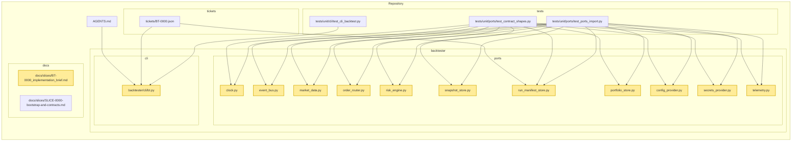

# BT-0000 — Bootstrap contracts & backtest CLI skeleton

> **Goal (plain words):** Give developers a tiny but runnable command-line tool that creates a backtest “run” folder with a manifest and a couple of structured log lines. Lock down the names and method shapes of core ports (interfaces) so later work can proceed in parallel without churn. “Done” means the CLI runs deterministically (seed recorded), the manifest is written, the ports import cleanly, and tests pass.
> **Assumptions:** Based on the provided repo snapshot (Python 3.11+, no network in backtests). We follow AGENTS.md invariants: deterministic by default, UTC time, fail-closed, and no implicit network I/O.

## What you will build (and why)
- CLI entrypoint (`backtester/cli/bt.py`) — Parses subcommands and implements `backtest --noop`. Why: One predictable way to run the system and produce artifacts.
- Port interface stubs (`backtester/ports/*.py`) — Protocols that define the shapes of boundaries (clock, event bus, data, orders, risk, stores, telemetry). Why: Freeze contracts early so other slices can build safely against them.
- Run manifest writer (JSON) — Writes `run_manifest.json` with fields `id`, `timestamp`, `version`, `seed`, `schema_version`, `mode`. Why: A reproducible, machine-readable record of each run.
- Minimal structured log emitter (JSONL) — Appends events with common fields (UTC timestamp, run_id, git_sha, seed, component). Why: Observability from the start.

## Acceptance criteria ⇄ How to verify
- Criterion: Running 'bt backtest --noop --out runs/test_run' creates directory with run_manifest.json containing keys: id, timestamp, version, seed (plus schema_version, mode).
  - Run:
    ```bash
    pip install -e .[dev]
    bt backtest --noop --out runs/test_run
    python - <<'PY'
    import json,sys
    m=json.load(open('runs/test_run/run_manifest.json'))
    required={'id','timestamp','version','seed','schema_version','mode'}
    print('OK' if required.issubset(m.keys()) else f'Missing: {required - set(m)}')
    PY
    ```
  - Expect: Prints `OK`. Files exist at `runs/test_run/run_manifest.json` and `runs/test_run/events.log.jsonl`.

- Criterion: Manifest generation is deterministic for fixed seed (same seed -> identical JSON except timestamp and id).
  - Run:
    ```bash
    rm -rf runs/test_a runs/test_b
    bt backtest --noop --out runs/test_a --seed 123
    bt backtest --noop --out runs/test_b --seed 123
    python - <<'PY'
    import json
    a=json.load(open('runs/test_a/run_manifest.json'))
    b=json.load(open('runs/test_b/run_manifest.json'))
    for k in ('timestamp','id'):
        a.pop(k,None); b.pop(k,None)
    print('OK' if a==b else f'DIFF\n{a}\n!=\n{b}')
    PY
    ```
  - Expect: Prints `OK`.

- Criterion: All port modules import cleanly under type check (pyright/mypy) with no runtime side effects.
  - Run:
    ```bash
    # Type check
    mypy backtester/ports
    # Import smoke
    python - <<'PY'
    import importlib
    mods=[
      'backtester.ports.clock','backtester.ports.event_bus','backtester.ports.market_data',
      'backtester.ports.order_router','backtester.ports.risk_engine','backtester.ports.snapshot_store',
      'backtester.ports.run_manifest_store','backtester.ports.portfolio_store','backtester.ports.config_provider',
      'backtester.ports.secrets_provider','backtester.ports.telemetry']
    for m in mods: importlib.import_module(m)
    print('OK')
    PY
    ```
  - Expect: `mypy` exits 0 and the Python import script prints `OK`.

- Criterion: LOC added (excluding tests + config/CI) <= 300.
  - Run:
    ```bash
    wc -l $(git ls-files 'backtester/cli/*.py' 'backtester/ports/*.py' 2>/dev/null) | tail -n1
    ```
  - Expect: The total line count for these files is within the 300 LOC budget for this slice.

- Criterion: CLI 'bt --help' lists subcommands: backtest, shadow, paper, live.
  - Run:
    ```bash
    bt --help | sed -n '1,120p'
    ```
  - Expect: Help text includes these subcommands with brief descriptions.

- Criterion: pytest -k test_cli_backtest_noop initially fails before implementation due to missing entrypoint (guards the slice).
  - Run (pre-implementation gate):
    ```bash
    # Before coding this slice (historical guard), tests fail with missing CLI
    pytest -k test_cli_backtest_noop -q
    ```
  - Expect: Failing test (missing entrypoint). After implementing this slice, rerun and expect pass.
  - Run (post-implementation):
    ```bash
    pytest -k "test_cli_backtest_noop or test_noop_twice_same_seed_identical_manifest_except_timestamp or test_all_ports_import or test_required_port_signatures" -q
    ```
  - Expect: All listed tests pass (exit code 0).

## Step‑by‑step plan (do these in order)
1. Add Protocol stubs for all ports with the exact method names/arity from the ticket. Why: Locks the boundary early. Check: `pytest -k ports -q` should collect and pass import/signature tests.
2. Create CLI skeleton with subparsers (backtest, shadow, paper, live) and implement `backtest --noop --out`. Why: We need a runnable entrypoint. Check: `bt --help` shows the four subcommands.
3. Implement minimal `RunManifestStore` and `Telemetry` (JSON + JSONL) and use UTC now from a `Clock`. Why: Produce concrete artifacts and log events deterministically. Check: `bt backtest --noop --out runs/try` writes `run_manifest.json` and `events.log.jsonl`.
4. Capture determinism: include `seed`, `schema_version`, `version`, and use a fresh `run_id`. Why: Reproducibility across runs. Check: Two runs with same seed have identical manifests except `timestamp` and `id`.
5. Wire console script `bt` in packaging (pyproject `project.scripts`). Why: Tests call the `bt` command. Check: `bt --help` runs after `pip install -e .`.
6. Type check and lint. Why: Keep interfaces clean and side‑effect free. Check: `mypy backtester/ports` exits 0; `ruff check` shows no errors.
7. Keep within LOC budget. Why: Enforces small slices discipline. Check: `wc -l ...` total ≤ 300.

## Files to create or change
### backtester/cli/bt.py
Purpose: Command line entrypoint for the app; owns argument parsing, noop run flow, manifest writing, and basic telemetry.
Content summary: `build_parser()`, `SystemClock`, `FilesystemRunManifestStore`, `JsonlTelemetry`, `run_noop(...)`, `main(argv)`.
Notes: All timestamps are UTC. No network calls. Exit code 0 on success; non‑implemented modes exit 2.

### backtester/ports/clock.py
Purpose: Time source contract.
Content summary: `class Clock(Protocol): now() -> datetime`.
Notes: Consumers must treat all datetimes as timezone‑aware (UTC).

### backtester/ports/event_bus.py
Purpose: Pub/sub contract for the core loop (future slices).
Content summary: `class EventBus(Protocol): publish(event: Event) -> None; subscribe(type: type[Event], handler: Callable[[Event], None]) -> None`.
Notes: No side effects on import; interface only.

### backtester/ports/market_data.py
Purpose: Streaming bars contract.
Content summary: `class MarketDataProvider(Protocol): stream_bars(symbol: str) -> Iterable[Bar]`.
Notes: Deterministic ordering expected (strictly increasing timestamps) once implemented later.

### backtester/ports/order_router.py
Purpose: Order submission/cancel contract.
Content summary: `class OrderRouter(Protocol): submit(order: Order) -> OrderAck; cancel(client_order_id: str) -> CancelAck`.
Notes: No real routing in this slice.

### backtester/ports/risk_engine.py
Purpose: Pre‑trade risk check contract.
Content summary: `class RiskEngine(Protocol): pre_trade_check(order: Order, portfolio: Portfolio) -> RiskDecision`.
Notes: Logic deferred; shape only.

### backtester/ports/snapshot_store.py
Purpose: Persist/load state snapshots.
Content summary: `class SnapshotStore(Protocol): write(snapshot: Snapshot) -> None; latest() -> Snapshot | None`.
Notes: No I/O in this slice beyond manifest.

### backtester/ports/run_manifest_store.py
Purpose: Persist the initial run manifest (this slice uses it).
Content summary: `class RunManifestStore(Protocol): init_run(manifest: RunManifest) -> None`.
Notes: File write should be atomic when expanded later; current simple write is acceptable here.

### backtester/ports/portfolio_store.py
Purpose: Load/save portfolio state.
Content summary: `class PortfolioStore(Protocol): load() -> Portfolio; save(portfolio: Portfolio) -> None`.
Notes: Interface only for now.

### backtester/ports/config_provider.py
Purpose: Access configuration values.
Content summary: `class ConfigProvider(Protocol): get(key: str) -> Any`.
Notes: Must be side‑effect‑free on import.

### backtester/ports/secrets_provider.py
Purpose: Access secrets (for live/paper later).
Content summary: `class SecretsProvider(Protocol): get(secret_name: str) -> str`.
Notes: Must not read environment or files on import.

### backtester/ports/telemetry.py
Purpose: Structured logging facade.
Content summary: `class Telemetry(Protocol): log(event: str, **fields: Any) -> None`.
Notes: In this slice, a tiny JSONL implementation suffices.

## Tests you will write (with reasons)
- Test name: CLI noop creates manifest
  - Checks: `bt backtest --noop --out <dir>` exits 0 and writes manifest with required keys.
  - Why this matters: Proves end‑to‑end run path exists and produces artifacts.
  - Skeleton:
    ```python
    def test_cli_backtest_noop_creates_manifest(tmp_path):
        out = tmp_path/"noop_run"
        p = subprocess.run(["bt","backtest","--noop","--out",str(out)], capture_output=True, text=True)
        assert p.returncode == 0
        m = json.loads((out/"run_manifest.json").read_text())
        assert {"id","timestamp","version","seed","schema_version","mode"} <= set(m)
    ```

- Test name: Same seed → same manifest (except timestamp/id)
  - Checks: Two runs with the same seed produce identical manifests after dropping `timestamp` and `id`.
  - Why this matters: Guarantees determinism for reproducible research.
  - Skeleton:
    ```python
    def test_noop_twice_same_seed_identical_manifest_except_timestamp(tmp_path):
        s=123; a=tmp_path/"a"; b=tmp_path/"b"
        subprocess.run(["bt","backtest","--noop","--out",str(a),"--seed",str(s)])
        subprocess.run(["bt","backtest","--noop","--out",str(b),"--seed",str(s)])
        m1=json.loads((a/"run_manifest.json").read_text()); m2=json.loads((b/"run_manifest.json").read_text())
        for k in ("timestamp","id"): m1.pop(k,None); m2.pop(k,None)
        assert m1==m2
    ```

- Test name: Ports import and shapes
  - Checks: Each port module imports; required method names and arity exist on the Protocol class.
  - Why this matters: Locks interfaces to avoid silent drift.
  - Skeleton:
    ```python
    @pytest.mark.parametrize('module_name',[
      'backtester.ports.clock','backtester.ports.event_bus','backtester.ports.market_data',
      'backtester.ports.order_router','backtester.ports.risk_engine','backtester.ports.snapshot_store',
      'backtester.ports.run_manifest_store','backtester.ports.portfolio_store','backtester.ports.config_provider',
      'backtester.ports.secrets_provider','backtester.ports.telemetry'])
    def test_all_ports_import(module_name):
        __import__(module_name)
    ```

## Determinism & safety checklist
- Seed is fixed and logged in the manifest and logs.
- Timezone is UTC everywhere; `Clock.now()` returns aware datetimes only.
- No network calls in backtest/noop modes.
- Artifacts are written under `--out` directory; later slices should make writes atomic.
- Fail closed: unimplemented modes return non‑zero and log an `unimplemented_mode` event.

## Performance & metrics
- Target: Not performance‑critical in this slice; ensure CLI cold start is snappy (< 200 ms on dev machines).
- Capture: Optional quick check using macOS time with peak memory.
  ```bash
  /usr/bin/time -l bt backtest --noop --out runs/perf_check --seed 1
  ```
- Also record LOC as a maintainability metric:
  ```bash
  wc -l $(git ls-files 'backtester/cli/*.py' 'backtester/ports/*.py' 2>/dev/null) | tail -n1
  ```

## Risks & mitigations (plain words)
- Naive datetimes (no tz): Would break determinism across machines. Mitigation: always use `timezone.utc`.
- Hidden side effects on import: Could make tests flaky. Mitigation: keep port modules pure Protocols only.
- CLI entrypoint not installed: Tests call `bt` and would fail. Mitigation: define console script in `pyproject.toml` and install with `pip install -e .`.
- Over‑budget LOC: Makes PRs hard to review. Mitigation: co‑locate tiny adapters in the CLI file for now.

## Mermaid diagram (repo now vs. changes in this slice)


## Done checklist

* [ ] All acceptance criteria pass.
* [ ] Two identical runs (same seed/data) produce the same checksum or identical manifest after excluding run‑specific fields.
* [ ] Coverage thresholds met (unit tests for CLI and ports included).
* [ ] Metrics captured and pasted above (basic runtime and LOC).
* [ ] Docs updated (this file) and any migration notes.
