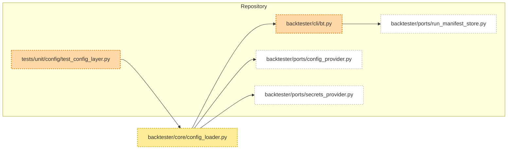

# BT-0001 — Deterministic layered config & secrets resolution

> **Goal (plain words):** Add a simple, trustworthy configuration and secrets layer so every run records exactly what settings it used, produces a stable hash, and never leaks secrets. This lets anyone reproduce a run later and be confident no hidden override changed behavior.
> **Assumptions:** Repo currently has ports, CLI manifest writer, but no config loader module; single symbol + shallow config structure; environment may lack pytest until dev deps installed.

## What you will build (and why)
- **ConfigLoader module** — Resolves config from four layers (defaults, file, env, CLI). *Why:* Ensures reproducible precedence so users can predict final values.
- **Validation step** — Checks required keys (`symbols`, `risk.max_position`). *Why:* Fails fast to avoid silent misconfiguration.
- **Secrets redaction logic** — Masks sensitive fields before persisting to manifest. *Why:* Prevents credential leakage in artifacts.
- **SecretsProvider adapter** — Minimal env-backed adapter that fetches secrets via logical names and never persists plaintext. *Why:* Keeps API keys and similar material outside of config snapshots while remaining deterministic.
- **Config hash computation** — Canonical JSON (sorted keys, compact) hashed with SHA256. *Why:* Allows quick equivalence check between runs.
- **Manifest extension** — Add `config_hash` and `config_keys` count plus a redacted `config` snapshot. *Why:* Captures provenance while keeping secrets safe.
- **Telemetry events** — `config_resolved`, `config_hash_computed`, `secrets_redacted`. *Why:* Structured breadcrumbs for observability and debugging.
- **Unit tests (failing -> passing)** — Guard the precedence, validation, redaction, and determinism. *Why:* Locks expected behavior for future refactors.

### Recommended minimal SecretsProvider implementation
- **Adapter location:** `backtester/adapters/secrets/env_provider.py` exporting `EnvSecretsProvider(SecretsProvider)`. Keep constructor arguments explicit: `(prefix: str = "BT_SECRET_", allowed: Mapping[str, str] | None = None)`.
- **Lookup contract:** `get(secret_name)` resolves to `env[prefix + allowed[secret_name]]`. A default allowlist `{"exchange_api_key": "EXCHANGE_API_KEY", "exchange_api_secret": "EXCHANGE_API_SECRET"}` prevents arbitrary environment scraping.
- **Failure mode:** Raise `MissingSecretError` (value error subclass) when a secret is absent; message must omit the resolved env var name to avoid leaking hints.
- **Runtime behavior:** Values stay in process memory only; do not memoize to globals or write to disk. If caching is needed later, add an in-memory LRU keyed by `secret_name` with opaque objects (no repr leaking the value).
- **Consumption pattern:** Config documents reference secrets by logical name (e.g. `"api_key": {"secret": "exchange_api_key"}`); loader resolves the secret just-in-time when building the runtime config but swaps in `***REDACTED***` before persistence.
- **Observability:** Emit debug-level metric `secrets_lookup_total{secret_name}` and structured log entry with fields `{"event": "secret_resolved", "secret_name": secret_name, "source": "env"}` but never include the secret value itself.
- **Extensibility hook:** Accept optional `fallback_path` (path to encrypted or `.secrets.json` file) in constructor but default to disabled; document that enabling it requires ADR since it changes IO behavior.

## Acceptance criteria ⇄ How to verify
- **Criterion:** Given identical defaults+file+env+CLI (any --set order) same seed ⇒ identical config hash.
  - **Run:** `pytest -q tests/unit/config/test_config_layer.py::test_config_hash_determinism`
  - **Expect:** Test passes; printed diff (if any) is empty.
- **Criterion:** Missing required key 'symbols' raises ValueError mentioning 'symbols'.
  - **Run:** `pytest -q tests/unit/config/test_config_layer.py::test_invalid_required_key_raises`
  - **Expect:** Test passes; internally the exception message contains 'symbols'.
- **Criterion:** Secret API key redacted in manifest/logs.
  - **Run:** `pytest -q tests/unit/config/test_config_layer.py::test_secrets_redacted_in_manifest`
  - **Expect:** Test passes; manifest contains `"api_key": "***REDACTED***"` not the raw value.
- **Criterion:** Precedence defaults<file<env<CLI proven via risk.max_position.
  - **Run:** `pytest -q tests/unit/config/test_config_layer.py::test_config_precedence_simple_key`
  - **Expect:** Test passes; internal assertion sees final value from CLI layer.
- **Criterion:** Two runs with same effective config produce manifests identical (ignoring id,timestamp) and include `config_hash`.
  - **Run:** (Add a helper later) `pytest -q tests/unit/config/test_config_layer.py::test_config_hash_determinism`
  - **Expect:** Hashes equal; test passes.

## Step-by-step plan (do these in order)
1. Create `backtester/core/config_loader.py` skeleton with resolve(), validate(), compute_hash(), redact(). *Why:* Centralizes logic before wiring. **Check:** `grep -n resolve backtester/core/config_loader.py` shows function names.
2. Implement precedence merge (apply layers sequentially). *Why:* Deterministic ordering ensures stable results. **Check:** Add temporary print or run hash test (will still fail until rest done).
3. Add validation for required keys. *Why:* Prevent later KeyErrors. **Check:** Run single test `pytest -q ...invalid_required_key_raises` now passes.
4. Implement canonical serialization + SHA256 hash. *Why:* Stable equality check. **Check:** `python -c "from backtester.core.config_loader import canonical_hash; print(canonical_hash({'a':1}))"` outputs 64 hex chars.
5. Implement `EnvSecretsProvider` with allowlisted env lookups and missing-secret errors. *Why:* Securely surface API keys without persisting them. **Check:** Temporary probe `python -c "from backtester.adapters.secrets.env_provider import EnvSecretsProvider; import os; os.environ['BT_SECRET_EXCHANGE_API_KEY']='abc'; print(EnvSecretsProvider().get('exchange_api_key'))"` prints `abc`.
6. Add redaction (replace listed secret keys). *Why:* Avoid leaks. **Check:** Run redaction test; ensure manifest fixture sees ***REDACTED***.
7. Wire loader into `run_noop` before manifest write; inject redacted config + metadata. *Why:* Persist provenance. **Check:** Manual run `bt backtest --noop --out runs/hash_test` then inspect `run_manifest.json`.
8. Emit telemetry events at resolution and hashing points. *Why:* Observability. **Check:** `tail runs/hash_test/events.log.jsonl` contains events.
9. Finalize tests and remove any temporary debug prints. *Why:* Keep clean surface. **Check:** `pytest -q -k config_layer` all green.
10. Update slice diagram and (optional) docs if not already committed. *Why:* Documentation parity. **Check:** Diagram renders in Mermaid preview.

## Files to create or change
### backtester/core/config_loader.py
**Purpose:** Provide deterministic resolution, validation, hashing, redaction.
**Content summary:** Functions: `resolve(layers)`, `validate(cfg)`, `canonical_json(cfg)`, `compute_hash(cfg)`, `redact(cfg, secret_keys)`; maybe a `ConfigLoader` thin class for cohesion.
**Notes:** All operations pure; no IO; timezone irrelevant here; raise ValueError on validation failures.

### backtester/adapters/secrets/env_provider.py
**Purpose:** Concrete `SecretsProvider` using environment variables with deterministic prefix + allowlist.
**Content summary:** `EnvSecretsProvider` class with constructor options (`prefix`, optional `allowed` map, optional disabled `fallback_path`), `get(secret_name)` implementation, `MissingSecretError`.
**Notes:** No global state; raising when secret missing; ensure `repr`/`__str__` do not leak values; redaction happens upstream.

### backtester/cli/bt.py
**Purpose:** Extend manifest generation to include config metadata.
**Content summary:** In `run_noop`, call loader, compute hash, redact, attach to manifest, emit telemetry events.
**Notes:** Keep changes small; do not alter existing schema keys; insert new keys after seed for readability; ensure JSON order deterministic using sorted serialization if rewriting.

### tests/unit/config/test_config_layer.py
**Purpose:** Assert precedence, validation, redaction, hash determinism.
**Content summary:** Replace pytest.fail placeholders with concrete assertions using the new loader API.
**Notes:** Keep tests isolated; avoid external files except optional minimal YAML/JSON.

### (Optional) tests/fixtures/config/minimal.yml
**Purpose:** Demonstrate file layer example.
**Content summary:** Minimal YAML: `symbols: [BTCUSDT]` and `risk: {max_position: 2}`.
**Notes:** Only if needed to clarify precedence test; can otherwise inline.

## Tests you will write (with reasons)
- **Test name:** test_config_precedence_simple_key
  - **Checks:** Highest-precedence CLI override wins.
  - **Why this matters:** Prevents hidden lower-layer values from silently applying.
  - **Skeleton:**
    ```python
    cfg = resolve_layers(defaults, file_cfg, env_cfg, cli_cfg)
    assert cfg["risk"]["max_position"] == 4
    ```
- **Test name:** test_invalid_required_key_raises
  - **Checks:** Missing `symbols` triggers ValueError.
  - **Why this matters:** Fails fast instead of later runtime errors.
  - **Skeleton:**
    ```python
    with pytest.raises(ValueError) as e:
        validate({"risk": {"max_position": 1}})
    assert "symbols" in str(e.value)
    ```
- **Test name:** test_secrets_redacted_in_manifest
  - **Checks:** Redacted value stored while original retrievable before redaction.
  - **Why this matters:** Eliminates secret leakage.
  - **Skeleton:**
    ```python
    cfg = {"api_key": "REAL", "symbols": ["BTCUSDT"], "risk": {"max_position":1}}
    red = redact(cfg, {"api_key"})
    assert red["api_key"] == "***REDACTED***"
    ```
- **Test name:** test_config_hash_determinism
  - **Checks:** Hash independent of override order when effective values same.
  - **Why this matters:** Guarantees reproducibility.
  - **Skeleton:**
    ```python
    c1 = resolve(...order1...)
    c2 = resolve(...order2...)
    assert compute_hash(c1) == compute_hash(c2)
    ```
- **Test name:** test_missing_secret_raises
  - **Checks:** `EnvSecretsProvider.get` raises `MissingSecretError` without leaking env var names when lookup fails.
  - **Why this matters:** Fail-closed behavior keeps secrets required and avoids hinting attackers.
  - **Skeleton:**
    ```python
    provider = EnvSecretsProvider()
    with pytest.raises(MissingSecretError) as exc:
        provider.get("exchange_api_key")
    assert "exchange_api_key" in str(exc.value)
    ```

## Determinism & safety checklist
- Seed logged already; keep usage unchanged.
- Canonical JSON with sorted keys prevents ordering drift.
- No network calls (pure in-memory operations only).
- Secrets replaced with `***REDACTED***` before disk.
- Validation errors raise ValueError (not warnings) to fail closed.

## Performance & metrics
- Target: Negligible (<1ms) for small config. Measure `config_hash_compute_ms` by timing hash function (optional monotonic timer).
- Capture `config_keys_total` (len of flattened key set) and increment `secrets_lookups_total` for each secret accessed.

## Risks & mitigations (plain words)
- Incorrect precedence implementation → Add explicit test for each layer combination; keep merge code simple.
- Secret missed in redaction → Central list / set of secret keys; unit test enumerates them.
- Hash instability due to non-deterministic serialization → Enforce sorted keys + compact separators.

## Mermaid diagram (repo now vs. changes in this slice)


## Done checklist
* [ ] All acceptance criteria pass.
* [ ] Two identical runs (same seed/data) produce the same checksum.
* [ ] Coverage thresholds met.
* [ ] Metrics captured and pasted above.
* [ ] Docs updated (this file) and any migration notes.
