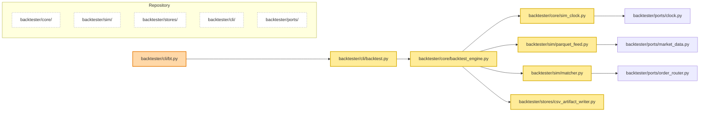

# BT-0002 — Implement deterministic single-symbol backtest loop

> **Goal (plain words):** Teach the backtester how to replay one BTCUSDT 1‑minute data set end to end so it produces deterministic trades and equity outputs on every run. This unlocks meaningful strategy work because it creates a predictable sandbox with auditable artifacts and error handling for bar quality issues.
> **Assumptions:** Repo state is based on `git ls-files backtester | sort` run on this branch; directories such as `backtester/core`, `backtester/cli`, `backtester/sim`, and `backtester/stores` already exist but many modules are still stubs.

## What you will build (and why)
- **backtester/core/backtest_engine.py** — Core loop that walks bars, calls the strategy, routes orders, and updates accounting. *Why:* This is the missing coordinator that turns raw slices into an actual backtest run.
- **backtester/core/sim_clock.py** — Clock that advances to each bar’s timestamp. *Why:* Strategies must see monotonic UTC time derived from data so determinism holds.
- **backtester/sim/parquet_feed.py** — Parquet reader with strict and gap-handling modes. *Why:* We need a deterministic, validated bar stream that logs gaps/duplicates up front.
- **backtester/sim/matcher.py** — Simplified matcher for market orders with constant slippage. *Why:* Without fills, we cannot compute realized/unrealized P&L.
- **backtester/stores/csv_artifact_writer.py** — Writer for `trades.csv` and `equity.csv`. *Why:* Artifacts make runs auditable and allow checksum comparisons across runs.
- **backtester/cli/backtest.py** — CLI glue that wires config/flags to the engine. *Why:* Users run `bt backtest`; this module hosts argument parsing and orchestration without bloating `bt.py`.
- **backtester/cli/bt.py (update)** — Import the new module and pass through arguments. *Why:* The existing entrypoint currently does nothing for backtests; we need to hook the new flow.

## Acceptance criteria ⇄ How to verify
- **Criterion:** Given fixtures tests/fixtures/config/backtest_single_symbol.yml and data/fixtures/bars/BTCUSDT_1m_2024-01-02.parquet, when `bt backtest --config ... --seed 42` runs twice, then trades.csv and equity.csv hashes match.
  - **Run:**
    ```bash
    bt backtest --config tests/fixtures/config/backtest_single_symbol.yml --out runs/determinism_a --seed 42 --strict
    bt backtest --config tests/fixtures/config/backtest_single_symbol.yml --out runs/determinism_b --seed 42 --strict
    shasum -a 256 runs/determinism_a/trades.csv runs/determinism_b/trades.csv
    shasum -a 256 runs/determinism_a/equity.csv runs/determinism_b/equity.csv
    ```
  - **Expect:** Both `shasum` commands print identical hashes for the paired files; manifests differ only in timestamp/run_id.
- **Criterion:** With data/fixtures/bars/BTCUSDT_1m_2024-01-02_duplicate_ts.parquet and `--strict`, abort before writing outputs, raise BarSequenceError, log `backtest.error`, and set manifest status to `failed_duplicate_timestamp`.
  - **Run:** `bt backtest --config tests/fixtures/config/backtest_single_symbol_strict_dup.yml --out runs/strict_fail --seed 42 --strict`
  - **Expect:** Exit code ≠ 0, `runs/strict_fail/run_manifest.json` contains `"status": "failed_duplicate_timestamp"`, and `runs/strict_fail/events.log.jsonl` includes `{"event":"backtest.error","error_code":"duplicate_timestamp"}`.
- **Criterion:** Deterministic buy at 00:03Z then sell at 00:04Z yields manifest `summary.realized_pnl == 50.0` and zero ending inventory.
  - **Run:** `pytest -q tests/unit/backtest/test_accounting_fifo.py::test_single_round_trip_realized_pnl`
  - **Expect:** Test passes and manifest fixture (`runs/test_round_trip/run_manifest.json`) shows `summary.realized_pnl` of 50.0 with `position_size` 0.
- **Criterion:** Gap handling with `--gap-mode fill-forward` inserts synthesized rows and counts them.
  - **Run:** `bt backtest --config tests/fixtures/config/backtest_single_symbol_fill_forward.yml --out runs/gap_fill --seed 42 --gap-mode fill-forward`
  - **Expect:** Command exits 0, `runs/gap_fill/equity.csv` has continuous minute rows, and manifest `summary.gap_fill_count` equals the number of missing bars in fixture.
- **Criterion:** Successful runs emit `backtest.completed` log with run metadata and record `backtest_duration_ms`.
  - **Run:** `bt backtest --config tests/fixtures/config/backtest_single_symbol.yml --out runs/telemetry_check --seed 123`
  - **Expect:** `events.log.jsonl` contains a `backtest.completed` line with `run_id`, `seed`, `bars_processed`, `fills_executed`, `duration_ms`; telemetry sink records `backtest_duration_ms` metric (visible in log or metrics buffer).

## Step-by-step plan (do these in order)
1. Sketch config + fixture needs from the Ticket. *Why:* Clear inputs ensure the engine API returns deterministic results. **Check:** `ls tests/fixtures/config` should show placeholder config filenames.
2. Implement `SimClock` that advances to the current bar timestamp and logs seed/time. *Why:* Clock is reused by engine and tests. **Check:** `pytest -q tests/unit/backtest/test_sim_clock.py::test_advances_to_bar_timestamp` (will be red until engine uses it).
3. Build the Parquet feed with strict/gap modes and gap logging. *Why:* This guards determinism early. **Check:** `pytest -q tests/unit/backtest/test_parquet_feed.py::test_strict_mode_duplicate_timestamp_raises` should fail with TODO until implementation completes.
4. Implement constant-slippage matcher plus FIFO accounting helper. *Why:* Trade outcomes need consistent pricing. **Check:** Run the FIFO unit test (will fail until accounting is wired).
5. Create `csv_artifact_writer` that writes trades/equity atomically with deterministic ordering. *Why:* Artifacts enable checksum comparisons. **Check:** Temporarily call writer from a REPL to ensure csv header order is stable.
6. Assemble `backtest_engine` to tie clock, feed, matcher, accounting, telemetry, and manifest writing. *Why:* Central orchestration defines slice value. **Check:** `pytest -q tests/integration/backtest/test_single_symbol_market_fill.py::test_replay_produces_identical_artifacts` should progress toward green.
7. Add CLI module `backtester/cli/backtest.py` and update `bt.py` to route the `backtest` command. *Why:* Users entrypoint must trigger new engine. **Check:** `bt backtest --noop` should now error with helpful message until config provided.
8. Flesh out deterministic strategy stub and fixtures referenced by tests. *Why:* Tests expect consistent behavior. **Check:** Re-run unit + integration tests; they should turn green.
9. Wire telemetry/logging + metrics counters and ensure manifest writes include status summaries. *Why:* Observability is an acceptance item. **Check:** Run `bt backtest ...` and inspect `events.log.jsonl` for expected events.
10. Document metrics capture (duration, counts) and run the determinism CLI scenario twice to confirm identical hashes. *Why:* Final end-to-end verification protects regressions. **Check:** `shasum -a 256 ...` matches as in acceptance.

## Files to create or change

### backtester/core/backtest_engine.py
**Purpose:** Own the backtest orchestration (clock → strategy → matcher → accounting → artifact/manifest write).
**Content summary:** `BacktestEngine` class with `run()` method, helper functions for manifest assembly, deterministic loop seeded via config, structured logging hooks.
**Notes:** Ensure UTC datetimes, no random calls without `seed`, and wrap errors to fail-closed with clear codes.

### backtester/core/sim_clock.py
**Purpose:** Provide a deterministic clock that tracks the current bar timestamp.
**Content summary:** `SimClock` class implementing `Clock` port methods (`now`, `advance_to`, optional async stubs).
**Notes:** Never move backwards; raise `ClockError` if asked to.

### backtester/sim/parquet_feed.py
**Purpose:** Stream validated bars from Parquet fixtures.
**Content summary:** `ParquetMarketDataProvider` implementing `MarketDataProvider`, strict/gap modes, gap logging helpers.
**Notes:** Enforce UTC, log duplicates/gaps via telemetry, surface `BarSequenceError` for invalid data.

### backtester/sim/matcher.py
**Purpose:** Match market orders with constant slippage and produce fills for accounting.
**Content summary:** `SimpleMatcher` class, `apply_market_order` function, P&L utilities.
**Notes:** Use deterministic math (Decimal or rounded floats) and support FIFO lot tracking.

### backtester/stores/csv_artifact_writer.py
**Purpose:** Emit deterministic CSV artifacts (trades/equity) per run.
**Content summary:** `CsvArtifactWriter` with `write_trades`, `write_equity`, helper for atomic temp-file swap.
**Notes:** Sort rows by timestamp, include headers once, and ensure temp file rename is atomic.

### backtester/cli/backtest.py
**Purpose:** Translate CLI flags/config into engine setup and execution.
**Content summary:** `run_backtest` function, argument parser helpers, error handling that maps to manifest statuses.
**Notes:** Log seed, config hash, and propagate `--strict`/`--gap-mode` flags.

### backtester/cli/bt.py (modify)
**Purpose:** Keep `bt` entrypoint thin while delegating to `run_backtest`.
**Content summary:** Import new module, extend subparser for flags, call `run_backtest`.
**Notes:** Maintain existing `--noop` support; default to deterministic seed 42.

## Tests you will write (with reasons)

### Unit tests
- **Test name:** `test_advances_to_bar_timestamp`
  - **Checks:** Clock advances to the bar’s timestamp without backwards jumps.
  - **Why this matters:** Strategies rely on `clock.now()` for ordering; non-monotonic time breaks determinism.
  - **Skeleton:**
    ```python
    from datetime import datetime, timezone
    from backtester.core.sim_clock import SimClock

    def test_advances_to_bar_timestamp():
        clock = SimClock(start=datetime(2024, 1, 2, tzinfo=timezone.utc))
        bar_ts = datetime(2024, 1, 2, 0, 3, tzinfo=timezone.utc)
        clock.advance_to(bar_ts)
        assert clock.now() == bar_ts
    ```

- **Test name:** `test_strict_mode_duplicate_timestamp_raises`
  - **Checks:** Duplicate timestamps trigger `BarSequenceError` and no bars are yielded.
  - **Why this matters:** Prevents data corruption from silently poisoning results.
  - **Skeleton:**
    ```python
    import pytest
    from backtester.sim.parquet_feed import ParquetMarketDataProvider, BarSequenceError

    def test_strict_mode_duplicate_timestamp_raises(tmp_path):
        feed = ParquetMarketDataProvider(path="...duplicate_ts.parquet", mode="strict")
        with pytest.raises(BarSequenceError):
            list(feed.stream_bars("BTCUSDT"))
    ```

- **Test name:** `test_single_round_trip_realized_pnl`
  - **Checks:** FIFO accounting computes 50.0 P&L for deterministic buy/sell pair.
  - **Why this matters:** Ensures fills drive correct equity snapshots.
  - **Skeleton:**
    ```python
    from backtester.sim.matcher import SimpleMatcher

    def test_single_round_trip_realized_pnl(sample_portfolio):
        matcher = SimpleMatcher(slippage_bps=0)
        matcher.apply_market_order(sample_portfolio, price=100.0, size=1)
        pnl = matcher.apply_market_order(sample_portfolio, price=150.0, size=-1)
        assert pnl.realized == 50.0
        assert matcher.portfolio.position == 0
    ```

### Integration tests
- **Test name:** `test_replay_produces_identical_artifacts`
  - **Checks:** Running the engine twice with same seed/data yields identical CSV hashes.
  - **Why this matters:** It proves determinism for the whole pipeline.
  - **Skeleton:**
    ```python
    import hashlib, shutil
    from backtester.cli import backtest

    def test_replay_produces_identical_artifacts(tmp_path, config_path):
        out_a = tmp_path / "run_a"
        out_b = tmp_path / "run_b"
        backtest.run_backtest(config_path, out_a, seed=42)
        backtest.run_backtest(config_path, out_b, seed=42)
        assert _hash(out_a / "trades.csv") == _hash(out_b / "trades.csv")
    ```

### Property tests
- **Test name:** `test_monotonic_timestamps_no_backwards`
  - **Checks:** Any generated timestamp regression raises `BarSequenceError`.
  - **Why this matters:** Protects against subtle dataset order bugs.
  - **Skeleton:**
    ```python
    from hypothesis import given, strategies as st
    from backtester.sim.parquet_feed import _validate_sequence, BarSequenceError

    @given(st.lists(st.datetimes(timezones=st.just(timezone.utc)), min_size=2, max_size=10))
    def test_monotonic_timestamps_no_backwards(seq):
        seq.sort()
        seq.insert(0, seq[-1])  # force backwards step
        with pytest.raises(BarSequenceError):
            _validate_sequence(seq)
    ```

## Determinism & safety checklist
- Seed is always supplied (default 42) and logged in both manifest and telemetry events.
- All timestamps use timezone-aware UTC datetimes; never operate on naive `datetime`.
- No network calls during backtests unless `--allow-net` becomes a future flag; keep this slice offline-only.
- CSV artifacts are written via temp files and atomic rename to avoid partial writes.
- On validation failures (duplicates, gaps in strict mode), abort the run with a clear error code and do not emit partial artifacts.

## Performance & metrics
- Target: Process a month of 1-minute bars in under 5 seconds on laptop-class hardware (slice spec).
- Capture `bars_per_sec`, `fills_executed_total`, and `backtest_duration_ms` via telemetry:
  - After each run, inspect `events.log.jsonl` for `backtest.completed` event fields (`bars_processed`, `duration_ms`).
  - Optional script:
    ```bash
    jq -r 'select(.event=="backtest.completed") | .bars_processed /.duration_ms * 1000' runs/telemetry_check/events.log.jsonl
    ```
  - Monitor memory via `python -m timeit` or `time` command if needed; keep footprint stable.

## Risks & mitigations (plain words)
- **Hidden nondeterminism:** Floating-point rounding or global state could differ between runs. *Mitigation:* Fix the seed, avoid random module calls, and format decimals consistently when writing CSVs.
- **Performance regressions:** Inefficient Parquet reads or accounting loops may slow future slices. *Mitigation:* Use vectorized reads where possible, and measure `duration_ms` during reviews.
- **Gap handling mistakes:** Filling gaps incorrectly can add look-ahead bias. *Mitigation:* Log every synthesized bar with context and keep strict mode as default for CI.

## Mermaid diagram (repo now vs. changes in this slice)


## Done checklist

* [ ] All acceptance criteria pass.
* [ ] Two identical runs (same seed/data) produce the same checksum.
* [ ] Coverage thresholds met.
* [ ] Metrics captured and pasted above.
* [ ] Docs updated (this file) and any migration notes.

## Config and fixture sketch (plain language)

- **Main backtest config (`tests/fixtures/config/backtest_single_symbol.yml`)**
  - Holds one symbol (`BTCUSDT`), run dates (start/end), and seed `42`.
  - Includes strategy settings for the simple “buy then sell” script: lot size, buy minute (`00:03`), sell minute (`00:04`).
  - Stores constant slippage as basis points (for example `slippage_bps: 0` means no slippage).
  - Points to the default bar file `data/fixtures/bars/BTCUSDT_1m_2024-01-02.parquet`.
  - Explains in comments that basis points (“bps”) means hundredths of a percent (100 bps = 1%).

- **Strict-mode config for duplicate timestamp test (`tests/fixtures/config/backtest_single_symbol_strict_dup.yml`)**
  - Same shape as the main config but references `BTCUSDT_1m_2024-01-02_duplicate_ts.parquet`.
  - Sets `strict: true` so any bad timestamp stops the run immediately.
  - Notes that “strict mode” means fail fast: no outputs are produced when data is corrupt.

- **Gap-fill config (`tests/fixtures/config/backtest_single_symbol_fill_forward.yml`)**
  - References `BTCUSDT_1m_2024-01-02_missing_gap.parquet`.
  - Adds `gap_mode: fill-forward` to tell the loader to create synthetic bars that reuse the last close price.
  - Adds a short comment explaining “fill-forward” (copy the prior bar to keep the timeline unbroken).

- **Parquet fixtures (all 1-minute bars)**
  - `BTCUSDT_1m_2024-01-02.parquet`: clean baseline dataset covering a short trading window; used for determinism checks.
  - `BTCUSDT_1m_2024-01-02_duplicate_ts.parquet`: copies the baseline and inserts one row with the same timestamp as the previous bar to simulate corrupt data.
  - `BTCUSDT_1m_2024-01-02_missing_gap.parquet`: removes one or two rows so the loader must fill the gap when not in strict mode.
  - Every file uses UTC timestamps and includes columns: `ts`, `open`, `high`, `low`, `close`, `volume`.
  - Store short README snippet beside fixtures describing how they were created and reminding that “UTC” stands for Coordinated Universal Time (global baseline for clocks).
